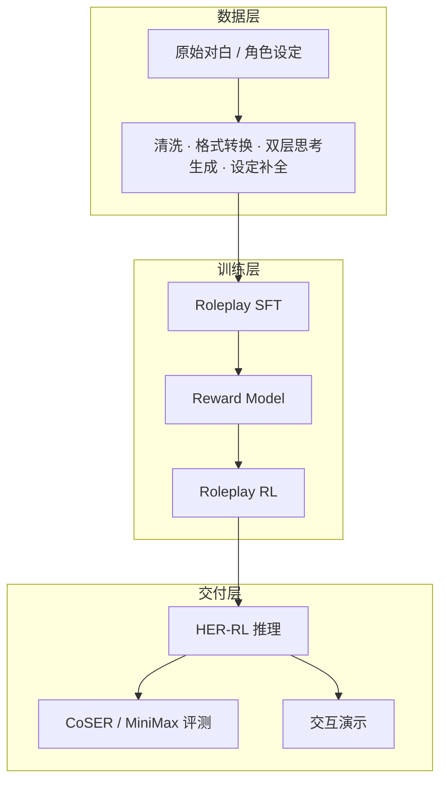

# HER

**Hierarchical Emotion Reasoning**

面向大语言模型角色扮演的一体化研发平台：覆盖数据构建、监督微调、奖励模型、强化学习、评测与交互演示。

[](https://arxiv.org/abs/2601.21459)
[](LICENSE)
[](https://www.python.org/)
[](https://huggingface.co/datasets/ChengyuDu0123/HER-Dataset)
[](https://huggingface.co/ChengyuDu0123/HER-32B)
[](https://huggingface.co/ChengyuDu0123/HER-RM-32B)

---

## 目录

- [项目定位](#项目定位)
- [核心能力](#核心能力)
- [系统架构](#系统架构)
- [仓库结构](#仓库结构)
- [环境要求](#环境要求)
- [快速开始](#快速开始)
- [数据处理](#数据处理)
- [模型训练](#模型训练)
- [评测](#评测)
- [基准结果](#基准结果)
- [文档](#文档)
- [发布资源](#发布资源)
- [支持](#支持)
- [引用](#引用)
- [许可证](#许可证)

---

## 项目定位

角色扮演场景（陪伴、内容生产、数字人、互动叙事）要求模型不仅模仿口吻与知识，还要稳定模拟角色的动机与内心过程。现有方案多停留在表层风格，难以约束「为什么这样说、这样做」。

HER 提供可复现的工程闭环，将认知级人设模拟拆成可训练、可评测、可演示的模块：

| 模块 | 职责 |
|------|------|
| 数据管线 | 从原始对白生成双层思考标注与角色设定补全 |
| 训练管线 | Roleplay SFT → Reward Model → Roleplay RL |
| 评测框架 | CoSER 多轮群体对话评测，支持本地与 API 模型 |
| 交互演示 | 文学场景对话、指定人设对话，用于验收与展示 |

适用对象：算法工程、数据工程、评测与产品验收。

---

## 核心能力

- **双层思考协议**：第三人称系统思考（如何扮演）与第一人称角色内心（角色怎么想）分离，再输出对白与动作。
- **推理增强数据**：基于 760 部作品对白做逆向构建，生成可训练的思考链路。
- **原则对齐奖励**：Reward Model 按可解释原则打分，驱动 RL 与人类偏好对齐。
- **端到端评测**：多轮、多智能体模拟，覆盖剧情一致性、拟人度、人设保真度与叙事质量。
- **可落地演示**：本地加载权重后即可交互，对话记录可落盘。

---

## 系统架构



### 响应协议

每轮模型输出按固定层次组织，便于训练、评测与产品侧过滤：

| 层级 | 视角 | 作用 | 对用户是否可见 |
|------|------|------|----------------|
| System Thinking | 第三人称 | 规划如何扮演该角色 | 默认隐藏 |
| Role Thinking | 第一人称 | 角色内心活动 | 默认隐藏，可按需展示 |
| Role Response | 第一人称 | 对白与可见动作 | 对外输出 |

---

## 仓库结构

```
HER-RL-SFT-RolePlay/
├── chat_demo/                 # 交互演示
│   ├── chat_demo.py           # CoSER / 文学场景多角色对话
│   ├── chat_demo2.py          # 指定人设对话（示例：岛村修）
│   └── coser_scenarios.json   # CoSER 场景数据
├── data_process_code/         # 数据合成
│   ├── step1_data_process/    # 清洗与格式转换
│   ├── step2_gen_rolethinking/
│   ├── step3_gen_systhinking/
│   └── step4_setting_completion/
├── training_code/             # 训练
│   ├── step1_roleplay_sft/
│   ├── step2_reward_sft/
│   ├── step3_reward_rl/
│   └── step4_roleplay_rl/
├── eval_code/                 # 评测
│   ├── benchmarks/            # CoSER 等多轮基准
│   ├── models/                # vLLM / API 适配
│   └── configs/               # 模型与评测配置
└── LICENSE
```

---

## 环境要求

| 项目 | 说明 |
|------|------|
| Python | 3.8 及以上 |
| 演示依赖 | `torch`、`transformers` |
| 评测依赖 | 见 `eval_code/requirements.txt` |
| 推理硬件 | 32B 量级权重建议单卡 80GB 或同等显存；8B 量级可在较小 GPU 上运行 |
| 训练硬件 | 多卡集群；具体并行策略见训练文档 |

---

## 快速开始

### 获取代码

```bash
git clone https://github.com/jiafuzeng/HER-RL-SFT-RolePlay.git
cd HER-RL-SFT-RolePlay
```

### 交互演示

将 `--model-path` 指向本地权重目录。

```bash
cd chat_demo

# 文学场景对话（默认加载 CoSER 场景）
python chat_demo.py --model-path /path/to/HER-32B

# 展示系统思考与角色内心（验收 / 分析用）
python chat_demo.py --model-path /path/to/HER-32B --show-think --show-rolethink

# 内置少量简易场景，不依赖完整 CoSER 文件
python chat_demo.py --model-path /path/to/HER-32B --simple

# 指定人设对话
python chat_demo2.py --model-path /path/to/model
```

`chat_demo.py` 会话命令：`退出` / `quit` 结束，`清空` / `clear` 重置上下文，`历史` / `history` 查看记录。退出时对话写入 `chat_demo/chat_logs/`。

更完整的演示说明见 [chat_demo/README.md](chat_demo/README.md)。

### 评测环境

```bash
cd eval_code
python -m venv .venv
source .venv/bin/activate
pip install -r requirements.txt
```

在 `eval_code/configs/models.yaml` 中配置 Actor 与 Judge，然后执行：

```bash
python run_coser.py \
    --actor your-model \
    --judge qwen-judge \
    --max-rounds 20
```

---

## 数据处理

主线：CoSER 原始对白 → 清洗转换 → Role Thinking 增强 → System Thinking 生成与改写 → 角色设定补全 → SFT 样本。

规模参考（管线文档统计）：约 29,081 段对话、383,654 轮；SFT 消融集约 342,493 条。

操作说明：[data_process_code/DATA_PIPELINE.md](data_process_code/DATA_PIPELINE.md)

---

## 模型训练

```
Roleplay SFT  →  Reward SFT / RM 训练  →  Roleplay RL  →  HER-RL
```

数据按用途切分（Roleplay SFT、RM SFT、RM RL、Roleplay RL、Test）。质量过滤与原则分阈值、Parquet 导出等细节见训练文档。

```bash
# 示例：SFT 格式转换
cd training_code/step1_roleplay_sft
python convert_to_sft.py
```

完整流程：[training_code/PIPELINE.md](training_code/PIPELINE.md)

---

## 评测

CoSER 多轮群体对话评测维度：

| 指标 | 含义 |
|------|------|
| SC Storyline Consistency | 多轮剧情与人设是否一致 |
| AN Anthropomorphism | 行为与情绪是否拟人 |
| CF Character Fidelity | 是否贴合角色设定 |
| SQ Storyline Quality | 对白与叙事整体质量 |

支持 vLLM 本地服务、OpenAI / Anthropic 及 OpenAI 兼容接口；长任务支持缓存与断点续跑。配置与参数见 [eval_code/README.md](eval_code/README.md)。

---

## 基准结果

相对同规模基座 **Qwen3-32B**，HER-RL 平均分：

| 基准 | Qwen3-32B | HER-RL | 提升 |
|------|-----------|--------|------|
| CoSER | 22.86 | **53.12** | **+30.26** |
| MiniMax Role-Play Bench | 50.76 | **65.73** | **+14.97** | |

---

## 文档

| 文档 | 内容 |
|------|------|
| [数据处理](data_process_code/DATA_PIPELINE.md) | 数据合成步骤、产物与统计 |
| [训练管线](training_code/PIPELINE.md) | SFT / RM / RL 数据切分与训练 |
| [评测说明](eval_code/README.md) | CoSER 运行方式与模型配置 |
| [交互演示](chat_demo/README.md) | 场景选择、参数与故障排查 |

---

## 发布资源

| 资源 | 地址 |
|------|------|
| 论文 | [arXiv:2601.21459](https://arxiv.org/abs/2601.21459) |
| 代码（上游） | [github.com/cydu24/HER](https://github.com/cydu24/HER) |
| 数据集 | [ChengyuDu0123/HER-Dataset](https://huggingface.co/datasets/ChengyuDu0123/HER-Dataset) |
| 策略模型 | [ChengyuDu0123/HER-32B](https://huggingface.co/ChengyuDu0123/HER-32B) |
| 奖励模型 | [ChengyuDu0123/HER-RM-32B](https://huggingface.co/ChengyuDu0123/HER-RM-32B) |

---

## 支持

问题与缺陷请通过本仓库 Issue 提交，并附上：运行命令、模型路径（勿含密钥）、日志关键片段、硬件环境。

---

## 引用

```bibtex
@article{her2025,
  title={HER: Human-like Reasoning and Reinforcement Learning for LLM Role-playing},
  author={Chengyu Du, Xintao Wang, Aili Chen, Weiyuan Li, Rui Xu, Junteng Liu, Zishan Huang, Rong Tian, Zijun Sun, Yuhao Li, Liheng Feng, Deming Ding, Pengyu Zhao, Yanghua Xiao},
  journal={arXiv preprint arXiv:2601.21459},
  year={2026}
}
```

---

## 许可证

本仓库以 [MIT License](LICENSE) 开源。

评测基准致谢：[CoSER](https://github.com/Neph0s/CoSER)、[MiniMax Role-Play Bench](https://www.minimax.io/news/a-deep-dive-into-the-minimax-m2-her-2)。
